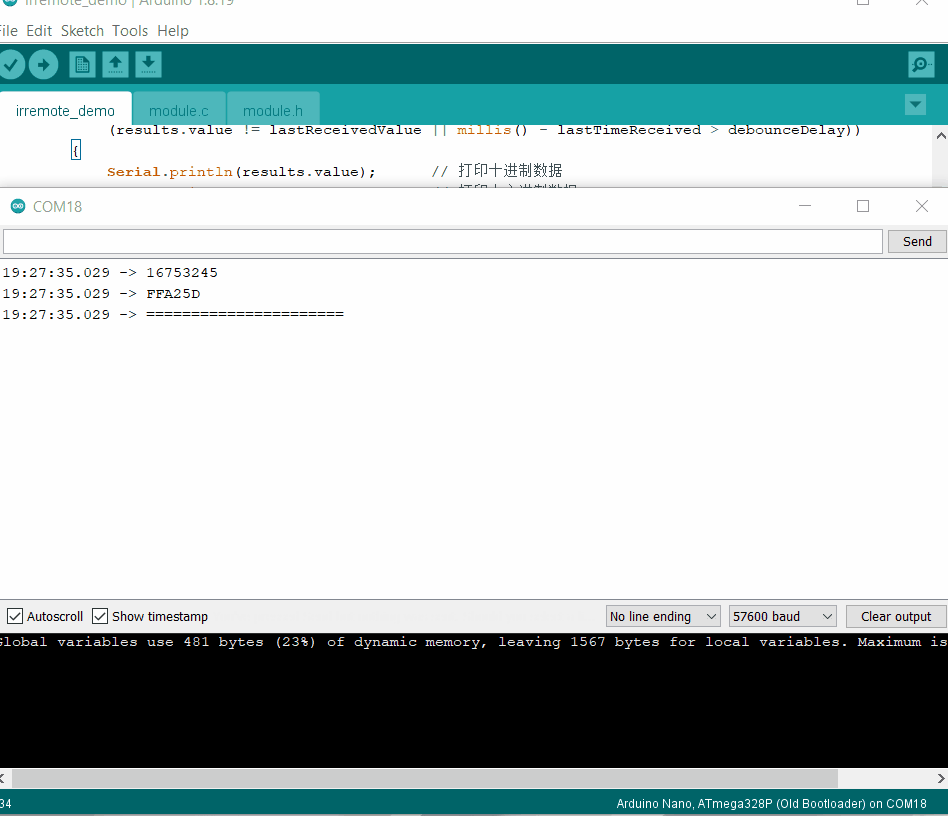
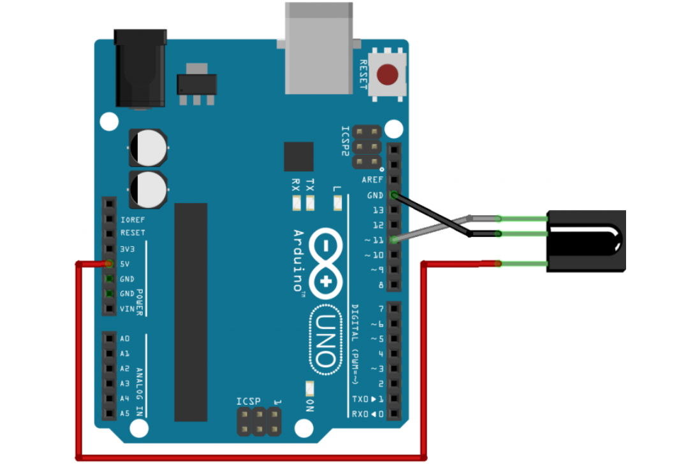
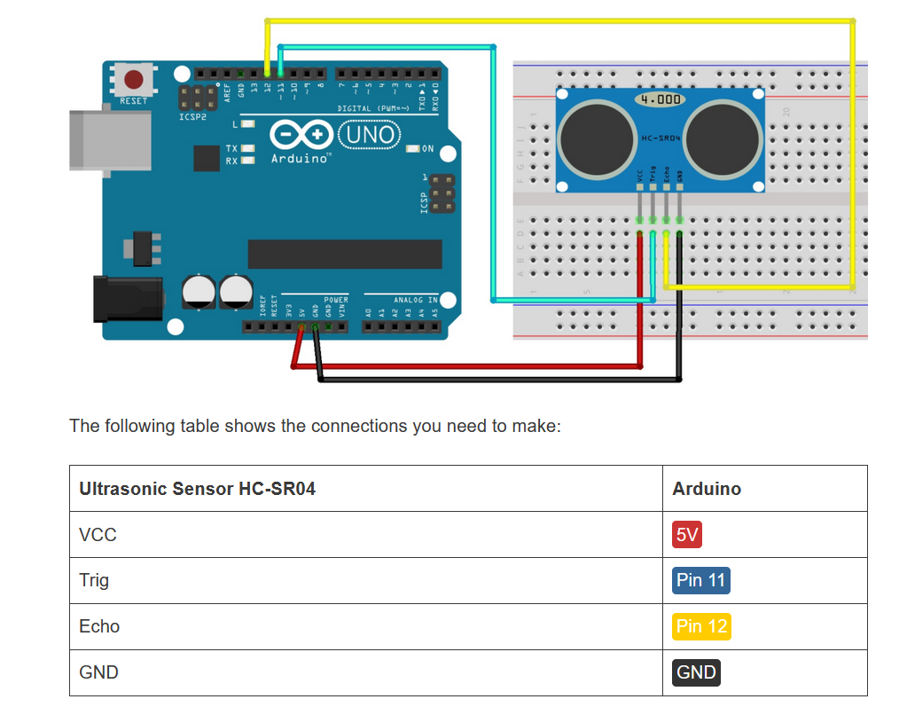
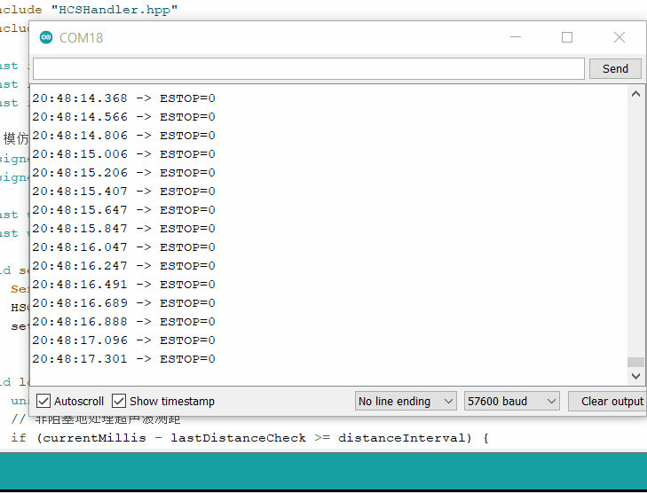
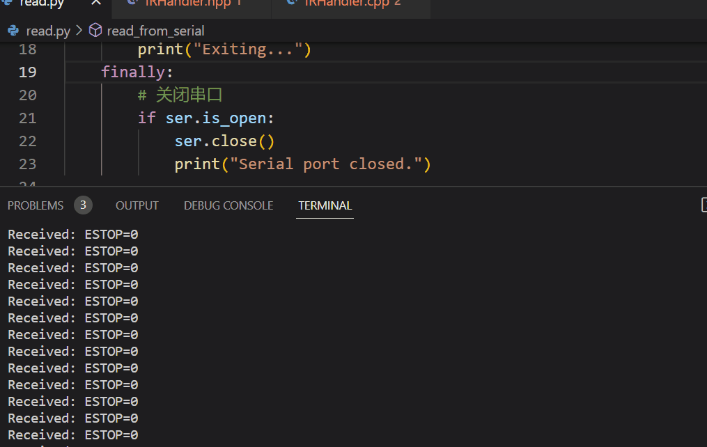

# 2 Arduino 的基本语法

## 2.1

## 2.2 Arduino 用 IRremote 库使用红外模块

### 2.2.1 结果

话不多说 直接上结果，打开窗口 就能看见获得的红外信号



### 2.2.2 接线

这个没啥好说的 就一个信号线

| Pin  | Description            |
| ---- | ---------------------- |
| VCC  | Powers the sensor (5V) |
| Data | Pin 11                 |
| GND  | Common GND             |



### 2.2.3 实现代码

```c
#include "IRremote.h"

int IR_RECEIVE_PIN = 11;            // 红外传输的数据引脚
long lastReceivedValue = 0;         // 存储上一次接收到的红外信号值
unsigned long lastTimeReceived = 0; // 存储上一次接收到红外信号的时间
int debounceDelay = 50;             // 可调延迟参数

IRrecv irrecv(IR_RECEIVE_PIN); // 红外模块初始化
decode_results results;        // 用于存放红外模块返回的数据

void setup()
{
    pinMode(LED_BUILTIN, OUTPUT); // 显示指示灯
    Serial.begin(57600);          // 设置Arduino通信的波特率
    irrecv.enableIRIn();
    Serial.println("Enabling IRin"); // 串口打印消息
}

void loop()
{
    if (irrecv.decode(&results))
    {
        // 检查是否接收到无效信号或是否间隔了一段时间（防止信号抖动）
        if ((results.value != 0xFFFFFFFF && results.value != 0x00000000) &&
            (results.value != lastReceivedValue || millis() - lastTimeReceived > debounceDelay))
        {
            Serial.println(results.value);      // 打印十进制数据
            Serial.println(results.value, HEX); // 打印十六进制数据
            Serial.println("======================");

            // 更新上一次接收到的信号值和时间
            lastReceivedValue = results.value;
            lastTimeReceived = millis();
        }
        else if (results.value == 0xFFFFFFFF || results.value == 0x00000000)
        {
            // 打印上次的值
            Serial.println(lastReceivedValue, HEX);
            Serial.println("======================");
        }
        irrecv.resume(); // 接收下一个值
    }
    delay(debounceDelay); // 延迟时间设为可调参数
}

```

- 后续根据按键接收到的信号值 做 switch 判断按了哪个按键即可

## 2.3 Arduino 使用 HC-SR04 超声波模块

### 2.3.1 结果

话不多说 直接上结果，打开窗口 就能看见获得的距离消息

### 2.3.2 接线

> 参考内容: [Complete Guide for Ultrasonic Sensor HC-SR04 with Arduino](https://randomnerdtutorials.com/complete-guide-for-ultrasonic-sensor-hc-sr04/)

> **冷知识**  
> Power Supply :+5V DC  
> Quiescent Current : <2mA  
> Working Current: 15mA  
> Effectual Angle: <15°  
> Ranging Distance : 2cm – 400 cm/1″ – 13ft  
> Resolution : 0.3 cm  
> Measuring Angle: 30 degree  
> Trigger Input Pulse width: 10uS TTL pulse  
> Echo Output Signal: TTL pulse proportional to the distance range  
> Dimension: 45mm x 20mm x 15mm

| Pin  | Description            |
| ---- | ---------------------- |
| VCC  | Powers the sensor (5V) |
| Trig | Trigger Input Pin 11   |
| Echo | Echo Output Pin 12     |
| GND  | Common GND             |



### 2.3.3 代码实现

可运行的最小 ino 代码

```c
const int trigPin = 9;   // 定义触发引脚为9
const int echoPin = 10;  // 定义回声引脚为10

float duration, distance; // 定义两个浮点变量：duration用于存储超声波的往返时间，distance用于存储计算得到的距离

void setup()
{
    pinMode(trigPin, OUTPUT); // 将触发引脚设置为输出模式
    pinMode(echoPin, INPUT);  // 将回声引脚设置为输入模式
    Serial.begin(57600);      // 初始化串口通信，波特率设置为57600
}

void loop()
{
    // 发送一个超声波脉冲
    digitalWrite(trigPin, LOW);  // 确保触发引脚初始为低电平
    delayMicroseconds(2);        // 等待2微秒
    digitalWrite(trigPin, HIGH); // 将触发引脚拉高，发送超声波脉冲
    delayMicroseconds(10);       // 保持高电平10微秒，以产生一个超声波脉冲
    digitalWrite(trigPin, LOW);  // 将触发引脚拉低，结束脉冲

    // 读取回声引脚的信号
    duration = pulseIn(echoPin, HIGH); // 读取回声引脚高电平持续的时间（微秒）

    // 计算距离
    distance = (duration * 0.0343) / 2; // 将时间转换为距离，单位为厘米
                                        // 超声波在空气中的速度约为343米/秒（0.0343厘米/微秒）
                                        // 因为时间是往返时间，所以除以2得到单程距离

    // 输出距离到串口监视器
    Serial.print("Distance: ");
    Serial.println(distance);

    delay(100); // 延时100毫秒，等待下一次测量
}
```

## 2.4 Arduino 同时运行多个功能代码

### 2.4.1 结果

同时运行红外和距离传感器功能，而且不会阻塞一方



### 2.4.2 文件结构

文件夹结构是打开项目的最关键的内容

创建一个名为 Arduino_Demo 的文件夹，并在该文件夹中包含一个名为 Arduino_Demo.ino 的文件, 这种命名方式有助于保持项目的一致性和可识别性，便于后续管理和开发, 也是 Arduino IDE 识别项目的关键

```shell
.
`-- Arduino_Demo
    |-- Arduino_Demo.ino    // 烧录代码的入口
    |-- HCSHandler.cpp      // 声波传感器实现代码
    |-- HCSHandler.hpp      // 声波传感器的头文件
    |-- HCSR04_Demo.txt     // 上面文件夹的ino文件的备份，可以删除 不重要
    |-- IRHandler.cpp       // 红外传感器的实现
    |-- IRHandler.hpp       // 红外传感器的头文件
    |-- IRremote_Demo.txt   // 上面文件夹的ino文件的备份，可以删除 不重要
    `-- ReadSerialData.py   // 利用python读取串口信息的demo文件，可以不要

1 directory, 8 files

```

### 2.4.2 .cpp/.hpp 代码实现

这些代码其实在上面内容都是有的 只是做了一些实际上有用的消息的包装，不过多介绍了，很简单

1. `HCSHandler.hpp`

```c
#ifndef HCSHANDLER_H
#define HCSHANDLER_H

#ifdef __cplusplus
extern "C"
{
#endif

    void HSCHandler_init(int trigPin, int echoPin); // 初始化函数，设置引脚和模式
    void HSCHandler_getDistance();                 // 获取距离函数，返回测量的距离

#ifdef __cplusplus
}
#endif

#endif

```

2. `HCSHandler.cpp`

```c
#include "HCSHandler.hpp"
#include "Arduino.h"

static int trigPin;    // 触发引脚
static int echoPin;    // 回声引脚
static float duration; // 超声波往返时间
static float distance; // 计算得到的距离

// 初始化函数，设置引脚和模式
void HSCHandler_init(int tPin, int ePin)
{
    trigPin = tPin;
    echoPin = ePin;
    pinMode(trigPin, OUTPUT);
    pinMode(echoPin, INPUT);
}

// 获取距离函数，返回测量的距离
void HSCHandler_getDistance()
{
    int estopFlag = 0;  // 0表示无距离危险
    // 发送一个超声波脉冲
    digitalWrite(trigPin, LOW);
    delayMicroseconds(2);
    digitalWrite(trigPin, HIGH);
    delayMicroseconds(10);
    digitalWrite(trigPin, LOW);

    // 读取回声引脚高电平持续的时间（微秒）
    duration = pulseIn(echoPin, HIGH);
    // 将时间转换为距离，单位为厘米
    // 超声波在空气中的速度约为343米/秒（0.0343厘米/微秒）
    // 因为时间是往返时间，所以除以2得到单程距离
    distance = (duration * 0.0343) / 2;
    if(distance < 20)
    {
      estopFlag = 1;
    }
     // 输出距离到串口监视器
    Serial.print("ESTOP=");
    Serial.println(estopFlag);
    delay(100); // 延时100毫秒，等待下一次测量
}

```

3. `IRHandler.hpp`

```c
#ifndef IRHANDLER_H
#define IRHANDLER_H

#ifdef __cplusplus
extern "C"
{
#endif

    void setupIR(int pin);                // 初始化
    void handleIR();                      // 处理信号
    int mapNum(unsigned long int decode); // 匹配按键

#ifdef __cplusplus
}
#endif

#endif

```

4. `IRHandler.cpp`

```c
#include "IRHandler.hpp"
#include "IRremote.h"

static int IR_RECEIVE_PIN = 11;            // 红外传输的数据引脚
static long lastReceivedValue = 0;         // 存储上一次接收到的红外信号值
static unsigned long lastTimeReceived = 0; // 存储上一次接收到红外信号的时间
static int debounceDelay = 100;            // 可调延迟参数

IRrecv irrecv(IR_RECEIVE_PIN); // 红外模块初始化
decode_results results;        // 用于存放红外模块返回的数据

void setupIR(int pin)
{
    IR_RECEIVE_PIN = pin;
    pinMode(LED_BUILTIN, OUTPUT); // 显示指示灯
    irrecv.enableIRIn();
    Serial.println("Enabling IRin"); // 串口打印消息
}

int mapNum(unsigned long int decode)
{
    int num = 99; // 99 表示无效内容
    switch (decode)
    {
    case 0xFFA25D:
        num = 1;
        break;
    case 0xFF629D:
        num = 2;
        break;
    case 0xFFE21D:
        num = 3;
        break;
    case 0xFF22DD:
        num = 4;
        break;
    case 0xFF02FD:
        num = 5;
        break;
    case 0xFFC23D:
        num = 6;
        break;
    case 0xFFE01F:
        num = 7;
        break;
    case 0xFFA857:
        num = 8;
        break;
    case 0xFF906F:
        num = 9;
        break;
    case 0xFF6897:
        num = 10;
        break;
    case 0xFF9867:
        num = 11;
        break;
    case 0xFFB04F:
        num = 12;
        break;
    case 0xFF18E7:
        num = 13;
        break;
    case 0xFF10EF:
        num = 14;
        break;
    case 0xFF38C7:
        num = 15;
        break;
    case 0xFF5AA5:
        num = 16;
        break;
    case 0xFF4AB5:
        num = 17;
        break;
    default:
        num = 99;
        break;
    }
    return num;
}

void handleIR()
{
    int moveNum = 99;
    if (irrecv.decode(&results))
    {
        // 检查是否接收到无效信号或是否间隔了一段时间（防止信号抖动）
        if ((results.value != 0xFFFFFFFF && results.value != 0x00000000) &&
            (results.value != lastReceivedValue || millis() - lastTimeReceived > debounceDelay))
        {
            moveNum = mapNum(results.value);
            Serial.print("MOVE=");
            Serial.println(moveNum);

            // 更新上一次接收到的信号值和时间
            lastReceivedValue = results.value;
            lastTimeReceived = millis();
        }
        else if (results.value == 0xFFFFFFFF || results.value == 0x00000000)
        {
            // 打印上次的值
            moveNum = mapNum(lastReceivedValue);
            Serial.print("MOVE=");
            Serial.println(moveNum);
        }
        irrecv.resume(); // 接收下一个值
    }
    delay(debounceDelay); // 延迟时间设为可调参数
}

```

### 2.4.3 Arduino_Demo.ino 代码实现

直接看代码，从代码角度来分析为什么这样写

- 关键点在于 用`cpp/hpp`管理具体的实现，结构好看
- 引入各个功能到 `loop` 里 即可实现全部的功能
- 使用 `millis()` 进行非阻塞时间管理
- 定时检查并获取声波传感器距离：`HSCHandler_getDistance()`
- 定时处理红外传感器信号：`handleIR()`

```c
#include "HCSHandler.hpp"
#include "IRHandler.hpp"

const int trigPin = 9;   // 定义声波传感器触发引脚为9
const int echoPin = 10;  // 定义声波传感器回声引脚为10
const int irremotePin = 11; // 定义红外的信号引脚为11

// 模仿多线程,也就是划分时间做某个函数的事情
unsigned long lastDistanceCheck = 0;  // 存储上一次接收到声波传感器的时间
unsigned long lastIRCheck = 0;  // 存储上一次接收到红外信号的时间

const unsigned long distanceInterval = 100; // 检查距离的时间间隔
const unsigned long irInterval = 100; // 检查红外信号的时间间隔

void setup() {
    Serial.begin(57600); // 初始化串口通信，波特率设置为57600
    HSCHandler_init(trigPin, echoPin); // 初始化声波传感器
    setupIR(irremotePin); // 初始化红外传感器
}

void loop() {
    unsigned long currentMillis = millis();
    // 非阻塞地处理超声波测距
    if (currentMillis - lastDistanceCheck >= distanceInterval) {
        lastDistanceCheck = currentMillis;
        HSCHandler_getDistance(); // 获取声波传感器距离
    }

    // 非阻塞地处理红外传感器
    if (currentMillis - lastIRCheck >= irInterval) {
        lastIRCheck = currentMillis;
        handleIR(); // 处理红外传感器
    }
}

```

## 2.5 利用 python 的 pyserial 库读取串口信息

### 2.5.1 结果



### 2.5.2 代码实现

直接上代码吧，这个太简单了, 需要安装 pyserial 库 `pip3 install pyserial`

```py

# sudo pip3 install pyserial

import serial

def read_from_serial(port, baudrate):
    try:
        # 打开串口
        ser = serial.Serial(port, baudrate, timeout=1)
        print(f"Connected to {port} at {baudrate} baud.")

        while True:
            # 读取一行数据
            line = ser.readline().decode('utf-8').strip()
            if line:
                print(f"Received: {line}")

    except serial.SerialException as e:
        print(f"Error: {e}")
    except KeyboardInterrupt:
        print("Exiting...")
    finally:
        # 关闭串口
        if ser.is_open:
            ser.close()
            print("Serial port closed.")

# 调用函数读取COM18端口的消息，波特率为57600
read_from_serial('COM18', 57600)

```
