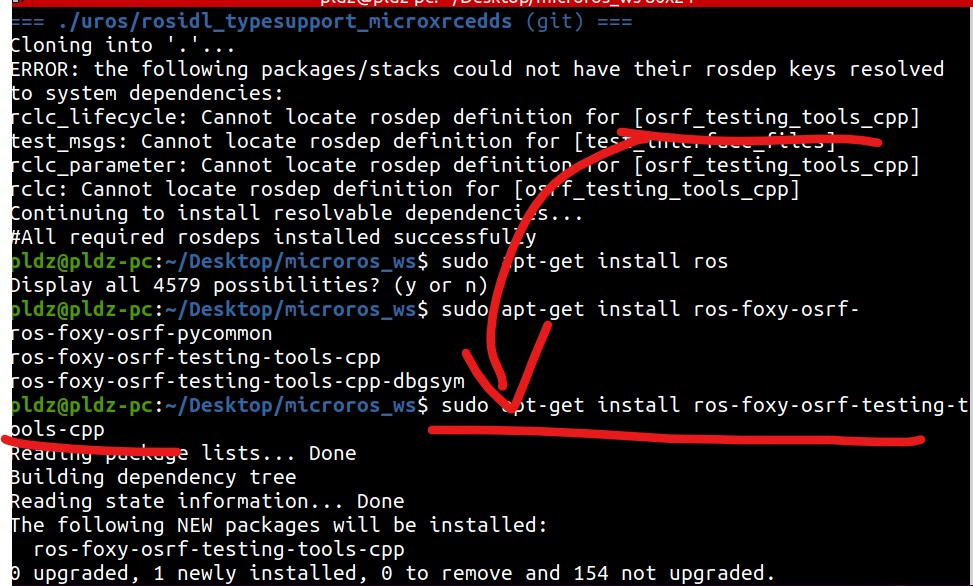
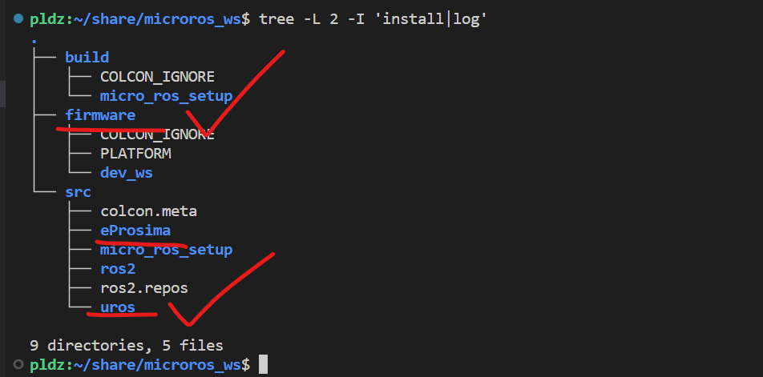
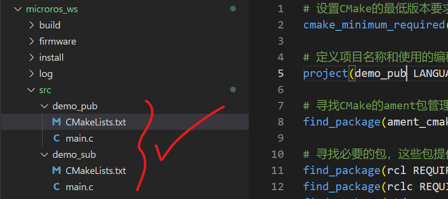
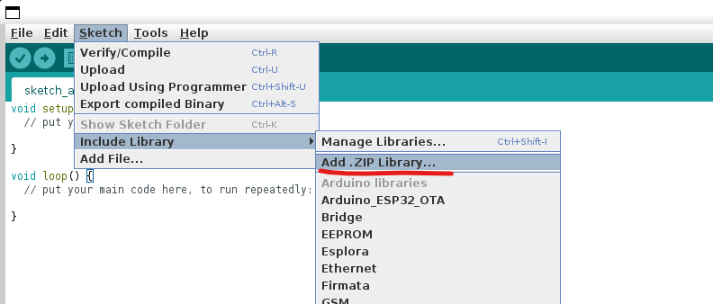
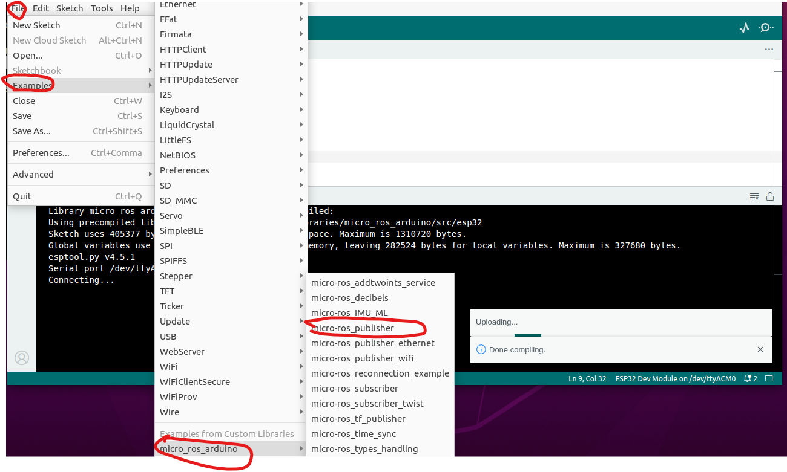

# 4 MircoROS 初步体验

> 这里还是强烈推荐使用 ros2 humble 也就是 Ubuntu22.04 的默认版本，如果大家是其他版本的，建议使用 docker 来模拟 micro ros 环境`sudo docker run -it --net=host -v /dev:/dev --privileged ros:humble`

> 参考内容
> [micro-ROS 官网教程](https://micro.ros.org/docs/tutorials/core/overview/)

从第一个例子来看，应该提前了解的一些基础概念

microROS： microROS 是一个适配于微控制器的 ROS 2 版本，它实现了 ROS 2 的一些核心功能，但是专门为内存和存储资源非常有限的环境优化。它支持多种微控制器架构和 RTOS（实时操作系统），允许这些设备能够在更广泛的 ROS 2 生态系统中进行通信和协作。

microROS Firmware： microROS Firmware 指的是安装在微控制器上的具体固件，这固件包含了 microROS 的客户端库以及为特定微控制器或硬件平台定制的配置。这个固件使得微控制器能够运行 microROS 应用程序，处理如传感器数据收集、执行器控制等任务，并通过 microROS Agent 与 ROS 2 网络中的其他节点进行交互。

microROS Agent： microROS Agent 是一个桥接软件，它允许微控制器（运行 microROS）与运行标凈 ROS 2 的更大的计算系统进行通信。这种通信通常通过网络如串行端口、UDP 或其他通信协议实现。microROS Agent 在较大的系统上运行，作为一个节点接收和发送消息，充当微控制器和其他 ROS 2 实体之间的中介。

## 4.1 在 Linux 平台上快速体验 MircoROS

Tips: 如果你的 rosdep 是有效的话 这个例子是很好跑的, 科学上网很重要，或者采用国内大神的`rosdepc` [参考](https://www.guyuehome.com/35408)

> 参考内容
> [First micro-ROS Application on Linux](https://micro.ros.org/docs/tutorials/core/first_application_linux/)>

### 4.1.1 下载官网的代码

跟着官网一起来(截止 2024.04.18 这些步骤都是有效的)

```py
# Source the ROS 2 installation

source /opt/ros/$ROS_DISTRO/setup.bash

# Create a workspace and download the micro-ROS tools

mkdir microros_ws
cd microros_ws
git clone -b $ROS_DISTRO https://github.com/micro-ROS/micro_ros_setup.git src/micro_ros_setup


# Update dependencies using rosdep
# 老版本的ros建议: rosdepc update --include-eol-distros
sudo apt update && rosdep update --include-eol-distros
rosdep install --from-paths src --ignore-src -y

# 如果说是跑官方例子的话是必须的 不然会出现报错
'''
ERROR: your rosdep installation has not been initialized yet.  Please run:

    sudo rosdep init
    rosdep update
'''

# Install pip
# sudo apt-get install python3-pip

# Build micro-ROS tools and source them
colcon build
source install/local_setup.bash
```


- 如果出现下面的错误，就手动安装依赖性，例如下下面的`sudo apt-get install ros-$ROS_DISTRO-xxx`
- 如果手动安装还是解决不了，很大可能你不是`ros-humble`造成的，因为在`rosdep update`时候可能被`Skip end-of-life distro "foxy"`或者是其他版本那么，需要`rosdepc update --include-eol-distros`了

```shell
ERROR: the following packages/stacks could not have their rosdep keys resolved
to system dependencies:
rclc_lifecycle: Cannot locate rosdep definition for [osrf_testing_tools_cpp]
test_msgs: Cannot locate rosdep definition for [test_interface_files]
rclc_parameter: Cannot locate rosdep definition for [osrf_testing_tools_cpp]
rclc: Cannot locate rosdep definition for [osrf_testing_tools_cpp]
Continuing to install resolvable dependencies...
```



### 4.1.1 创建 mirco-ros fireware workspace

- fireware workspace 是做什么的，我在这一步能不能跳过啊？ 问问万能的 GPT： firmware workspace 是一个特殊的目录结构和工作区，用于开发和构建特定于微控制器的固件。这个工作区包括了所有必要的组件来创建和配置微控制器固件，以便它能与 ROS 2 系统兼容和交互。

  - 在这个工作区中，Micro-ROS 的客户端库被配置和编译为固件。这包括生成必要的通信接口和适应层，使微控制器能够通过适当的通信协议（如 UART、TCP/IP 等）与 ROS 2 系统通信。

  - 包含 Micro-ROS 客户端库：
    Micro-ROS 客户端库是一个适配层，它提供了与 ROS 2 兼容的 API，但优化了内存和处理能力的限制，适用于微控制器。

  - 集成外部库和驱动程序：允许开发者集成硬件特定的驱动程序和中间件，例如用于传感器数据获取和执行器控制的库。

  - 构建和部署工具：提供工具和脚本来构建和部署固件到目标硬件，这些工具通常与微控制器的编程环境（如 ARM Mbed、ESP-IDF 等）集成。

  - 调试和测试：这个工作区也支持固件的调试和测试，这对于确保在资源受限的环境中运行正常至关重要。

  - 这一步是不能够省略的

- 动手就是干：

```shell
source install/local_setup.bash && ros2 run micro_ros_setup create_firmware_ws.sh host
```

当命令执行完毕后，工作区中应该存在一个名为 firmware 的文件夹，并且 这个步骤的目的是下载一组 micro-ROS 应用程序，到 src/uros/micro-ROS-demos/rclc 路径下，这个 repo 再 GitHub 也是有的，如果你没有出现这两个文件夹 那说明 你这一步操作失败了，用`tree -L 2 -I 'install|log'`查看



如果你已经有了上面这些文件夹的内容，那么可以开始构建这个 mirco-ros 的全部依赖项了

```shell
source install/local_setup.bash && ros2 run micro_ros_setup build_firmware.sh
```

如果 build 成功后大概是有 38 个功能包安装好了的:


> 解释一下这个 micro-ROS-demos，里面的代码都包括两个文件：
>
> - main.c：应用程序的逻辑。
> - CMakeLists.txt：编译应用程序的脚本。
>   如果我们想创建自定义应用程序，就在这个文件夹下创建一个叫<my_app>的文件夹，其中包含上述两个文件。然后还需要跑到 `src/uros/micro-ROS-demos/rclc/CMakeLists.txt` 中注册，通过添加以下行：`export_executable(<my_app>)`这样注册进来，好了 废话不多说用到再看

### 4.1.3 体验 MicroROS 的发布和订阅

做完上面两步，是时候来体验`mirco-ros`的发布和订阅了，其实也就是顺着官网的教程继续往下走,但是官网的`ping_pong`的例子太麻烦了，我们这之间上后续的发布和订阅的的例子，**但是这个例子的条件是你已经走完了上面那一步，有了那些依赖项**

> 参考内容
> [Publishers and subscribers](https://micro.ros.org/docs/tutorials/programming_rcl_rclc/pub_sub/)

1. 创建两个 demo 的源文件夹, 然后就朝着里面的文件进行填内容

```shell
mkdir mkdir src/demo_pub && touch src/demo_pub/main.c && touch src/demo_pub/CMakeLists.txt && mkdir src/demo_sub && touch src/demo_sub/main.c && touch src/demo_sub/CMakeLists.txt
```



2. 直接上能跑的发布者代码，注释在代码里，了解基本的内容即可，不得不说现在的 GPT 太强了：

- 发布者的 main.c [demo_pub/main.c](https://github.com/micro-ROS/micro-ROS-demos/blob/humble/rclc/int32_publisher/main.c)

```c
#include <rcl/rcl.h>
#include <rcl/error_handling.h>
#include <rclc/rclc.h>
#include <rclc/executor.h>

#include <std_msgs/msg/int32.h>

#include <stdio.h>
#include <unistd.h>

// 宏定义用于错误检查，如果发生错误则输出并退出或继续
#define RCCHECK(fn) { rcl_ret_t temp_rc = fn; if((temp_rc != RCL_RET_OK)){printf("Failed status on line %d: %d. Aborting.\n",__LINE__,(int)temp_rc); return 1;}}
#define RCSOFTCHECK(fn) { rcl_ret_t temp_rc = fn; if((temp_rc != RCL_RET_OK)){printf("Failed status on line %d: %d. Continuing.\n",__LINE__,(int)temp_rc);}}

rcl_publisher_t publisher; // 全局发布者对象
std_msgs__msg__Int32 msg; // 整数类型的消息

// 定时器回调函数，每次调用时发布一个消息，并增加计数
void timer_callback(rcl_timer_t * timer, int64_t last_call_time)
{
    (void) last_call_time;
    if (timer != NULL) {
        RCSOFTCHECK(rcl_publish(&publisher, &msg, NULL));
        printf("Sent: %d\n", msg.data);
        msg.data++;
    }
}

int main()
{
    rcl_allocator_t allocator = rcl_get_default_allocator(); // 获取默认分配器
    rclc_support_t support;

    // 初始化支持结构
    RCCHECK(rclc_support_init(&support, 0, NULL, &allocator));

    // 创建节点
    rcl_node_t node;
    RCCHECK(rclc_node_init_default(&node, "int32_publisher_rclc", "", &support));

    // 创建发布者
    RCCHECK(rclc_publisher_init_default(
        &publisher,
        &node,
        ROSIDL_GET_MSG_TYPE_SUPPORT(std_msgs, msg, Int32),
        "std_msgs_msg_Int32"));

    // 创建定时器
    rcl_timer_t timer;
    const unsigned int timer_timeout = 1000; // 定时器超时时间为1000毫秒
    RCCHECK(rclc_timer_init_default(
        &timer,
        &support,
        RCL_MS_TO_NS(timer_timeout),
        timer_callback));

    // 创建执行器
    rclc_executor_t executor = rclc_executor_get_zero_initialized_executor();
    RCCHECK(rclc_executor_init(&executor, &support.context, 1, &allocator));
    RCCHECK(rclc_executor_add_timer(&executor, &timer));

    msg.data = 0; // 初始化消息数据

    rclc_executor_spin(&executor); // 执行器开始执行

    // 清理资源
    RCCHECK(rcl_publisher_fini(&publisher, &node));
    RCCHECK(rcl_node_fini(&node));
}

```

- 发布者的 CMakeLists.txt 文件内容：(demo_pub/CMakeLists.txt)[https://github.com/micro-ROS/micro-ROS-demos/blob/humble/rclc/int32_publisher/CMakeLists.txt]

```cmake
# 设置CMake的最低版本要求为3.5
cmake_minimum_required(VERSION 3.5)

# 定义项目名称和使用的编程语言
project(demo_pub LANGUAGES C)

# 寻找CMake的ament包管理工具，这是ROS 2中常用的包管理工具
find_package(ament_cmake REQUIRED)

# 寻找必要的包，这些包提供ROS 2和microROS的功能
find_package(rcl REQUIRED)          # ROS 2 client library (rcl)
find_package(rclc REQUIRED)         # ROS 2 client library for the C language (rclc)
find_package(std_msgs REQUIRED)     # 标准消息定义，用于ROS 2通信
find_package(rmw_microxrcedds REQUIRED)  # 为microROS提供的中间件实现

# 添加一个可执行文件目标，名为项目名称，源代码文件为 main.c
add_executable(${PROJECT_NAME} main.c)

# 将上述找到的包作为编译目标的依赖项
ament_target_dependencies(${PROJECT_NAME}
  rcl
  rclc
  std_msgs
  rmw_microxrcedds
)

# 安装构建的可执行文件到安装目录下的项目名称文件夹中
install(TARGETS ${PROJECT_NAME}
  DESTINATION ${PROJECT_NAME}
)
```

3. 直接上能跑的订阅者的代码，解释全部再注释内，了解过程即可

- 订阅者的 main.c [int32_publisher_subscriber/main.c](https://github.com/micro-ROS/micro-ROS-demos/blob/humble/rclc/int32_publisher_subscriber/main.c)

```c
#include <rcl/rcl.h>
#include <rcl/error_handling.h>
#include <rclc/rclc.h>
#include <rclc/executor.h>
#include <std_msgs/msg/int32.h>
#include <stdio.h>

// 宏定义用于检查函数返回值，并在出现错误时输出错误信息
#define RCCHECK(fn) { rcl_ret_t temp_rc = fn; if((temp_rc != RCL_RET_OK)){printf("Failed status on line %d: %d. Aborting.\n",__LINE__,(int)temp_rc); return 1;}}
#define RCSOFTCHECK(fn) { rcl_ret_t temp_rc = fn; if((temp_rc != RCL_RET_OK)){printf("Failed status on line %d: %d. Continuing.\n",__LINE__,(int)temp_rc);}}

rcl_publisher_t publisher; // 发布者对象
rcl_subscription_t subscriber; // 订阅者对象
std_msgs__msg__Int32 send_msg; // 发送的消息
std_msgs__msg__Int32 recv_msg; // 接收的消息

// 定时器回调函数，用于周期性发布消息
void timer_callback(rcl_timer_t * timer, int64_t last_call_time)
{
    (void) last_call_time; // 忽略未使用的参数
    if (timer != NULL) {
        RCSOFTCHECK(rcl_publish(&publisher, &send_msg, NULL));
        printf("Sent: %d\n", send_msg.data);
        send_msg.data++;
    }
}

// 订阅者回调函数，当接收到新消息时被调用
void subscription_callback(const void * msgin)
{
    const std_msgs__msg__Int32 * msg = (const std_msgs__msg__Int32 *)msgin;
    printf("Received: %d\n", msg->data);
}

int main(int argc, const char * const * argv)
{
    rcl_allocator_t allocator = rcl_get_default_allocator(); // 获取默认分配器
    rclc_support_t support;

    // 初始化支持结构，用于配置ROS 2通信
    RCCHECK(rclc_support_init(&support, argc, argv, &allocator));

    // 创建节点
    rcl_node_t node;
    RCCHECK(rclc_node_init_default(&node, "int32_publisher_subscriber_rclc", "", &support));

    // 创建发布者
    RCCHECK(rclc_publisher_init_default(
        &publisher,
        &node,
        ROSIDL_GET_MSG_TYPE_SUPPORT(std_msgs, msg, Int32),
        "int32_publisher"));

    // 创建订阅者
    RCCHECK(rclc_subscription_init_default(
        &subscriber,
        &node,
        ROSIDL_GET_MSG_TYPE_SUPPORT(std_msgs, msg, Int32),
        "int32_subscriber"));

    // 创建定时器，设置超时时间为1000毫秒
    rcl_timer_t timer;
    const unsigned int timer_timeout = 1000;
    RCCHECK(rclc_timer_init_default(
        &timer,
        &support,
        RCL_MS_TO_NS(timer_timeout),
        timer_callback));

    // 创建执行器，并添加定时器和订阅者
    rclc_executor_t executor = rclc_executor_get_zero_initialized_executor();
    RCCHECK(rclc_executor_init(&executor, &support.context, 2, &allocator));
    RCCHECK(rclc_executor_add_timer(&executor, &timer));
    RCCHECK(rclc_executor_add_subscription(&executor, &subscriber, &recv_msg, &subscription_callback, ON_NEW_DATA));

    send_msg.data = 0; // 初始化发送消息的数据

    // 运行执行器，开始处理事件
    rclc_executor_spin(&executor);

    // 清理资源，销毁发布者、订阅者和节点
    RCCHECK(rcl_subscription_fini(&subscriber, &node));
    RCCHECK(rcl_publisher_fini(&publisher, &node));
    RCCHECK(rcl_node_fini(&node));
}

```

- 订阅者的 CMakeLists [int32_publisher_subscriber/CMakeLists.txt](https://github.com/micro-ROS/micro-ROS-demos/blob/humble/rclc/int32_publisher_subscriber/CMakeLists.txt)

```cmake
cmake_minimum_required(VERSION 3.5)

project(demo_sub LANGUAGES C)

find_package(ament_cmake REQUIRED)
find_package(rcl REQUIRED)
find_package(rclc REQUIRED)
find_package(std_msgs REQUIRED)
find_package(rmw_microxrcedds REQUIRED)

add_executable(${PROJECT_NAME} main.c)

ament_target_dependencies(${PROJECT_NAME}
  rcl
  rclc
  std_msgs
  rmw_microxrcedds
  )

install(TARGETS ${PROJECT_NAME}
  DESTINATION ${PROJECT_NAME}
  )
```

4. 编译运行 查看效果

```shell
colcon build
```

## 4.2 使用 ESP32 发布话题 体验 MircoROS 的通讯

> Tips: 需要完成上面的`micro ros 的 fireware workspace`的构建

> 参考内容
> [ROS2 与 arduino 入门教程-安装 micro_ros_arduino](https://www.ncnynl.com/archives/202012/3988.html)  
> [Arduino 配置 micro-ros](https://blog.csdn.net/houzima/article/details/126786365)

1. 安装 `arduino ide`并下载`esp32`的开发工具包， 网上搜索一大堆

2. 添加 `mirco_ros_arduino`到库内

- 到 GitHub 仓库的 release 下，下载对应 ROS 版本的 zip 包：[micro-ROS/micro_ros_arduino](https://github.com/micro-ROS/micro_ros_arduino/releases)


- 添加 Zip 包到`arduino-ide`内:



3. 跑 demo 例子

- 接入 esp32 板卡

- 需要下载`pyserial`: `sudo pip install pyserial`

- 给板卡端口赋权限`sudo chmod 777 /dev/ttyUSB0` 或者是 `sudo chmod 777 /dev/ttyACM0`等其他 就看你的开发板端口了

- 选择 `micro-ros-publish`例子烧录



- 查看你的板卡烧录情况


4. 主机测试连接情况

- 回到上述的`microros_ws`下， 构建`micro_ros_agent`:

```shell
source install/local_setup.bash && ros2 run micro_ros_setup build_agent.sh
```

- 构建完成之后测试
