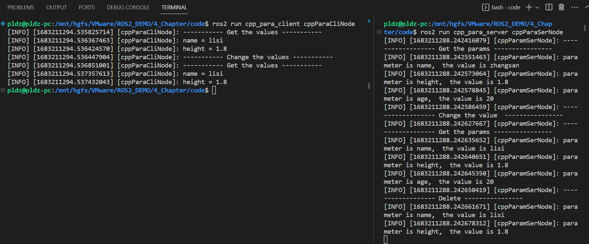

# 4 ROS2节点参数基础

## 4.1 ROS2节点参数介绍

> 参考内容
>
> [Understanding parameters](https://docs.ros.org/en/humble/Tutorials/Beginner-CLI-Tools/Understanding-ROS2-Parameters/Understanding-ROS2-Parameters.html#load-parameter-file-on-node-startup)

在ROS2的通讯过程中，有一种信息记录某个节点的特征，例如turtlesim仿真时候的乌龟类型，背景的颜色等等，这一类节点设置的数据，通常采用节点参数(`parameters`)进行设置和操作，可以把节点参数认为是对节点的设置，可以对参数进行增删改查的操作

## 4.2 使用C/C++实现对节点参数的增删改查

> 示例创建一个节点参数的服务端，和一个节点参数的客户端，服务端用于实现后续客户端对它的参数进行增删改查操作

> 参考内容
>
> [Using parameters in a class (C++)](https://docs.ros.org/en/humble/Tutorials/Beginner-Client-Libraries/Using-Parameters-In-A-Class-CPP.html)
>
> [2.5.3_参数服务_C++实现_03客户端_01代码框架](https://www.bilibili.com/video/BV1Me411j7hK)

### 4.2.1 创建C/C++节点参数的服务端

1. 创建功能包，包名为`cpp_para_ser`，节点名为`cppParaSerNode`，依赖`rclcpp`：`ros2 pkg create cpp_para_server --build-type ament_cmake --node-name cppParaSerNode --dependencies rclcpp`

2. 配置Vscode环境，在工作空间创建`.vscode`文件夹，并加入`settings.json`文件，添加`ROS2`的`include`环境：

```json
{
    "C_Cpp.default.includePath": [
        "/opt/ros/humble/include/**",
    ],
}
```

3. 创建节点参数服务：注意删除节点的参数，只能删除未被声明的内容：

```cpp
// 1. 生成节点的头文件
#include "rclcpp/rclcpp.hpp"

// 2. 定义节点参数服务端
class CppParamServer : public rclcpp::Node
{
public:
  // 2.1 构造函数，设置节点名，以及允许被删除的内容
  CppParamServer() : Node("cppParamSerNode",rclcpp::NodeOptions().allow_undeclared_parameters(true)) {}

  // 2.2 创建默认的参数表
  void declare_param()
  {
    // 2.2.1 声明参数并设置默认值
    this->declare_parameter("name", "zhangsan");
    this->declare_parameter("height", "1.8");

    // 2.2.2 未声明的参数，该参数可以被删除
    this->set_parameter(rclcpp::Parameter("age", "20"));
  }

  // 3 获取到现在的所有参数
  void get_AllValue()
  {
    RCLCPP_INFO(this->get_logger(), "------------------ Get the params ----------------");
    auto params = this->get_parameters({"name", "height", "age"});
    for (auto &param : params)
    {
      // 3.1 get_name函数获取参数名，value_to_string获取到参数的字符串值
      RCLCPP_INFO(this->get_logger(), "parameter is %s,  the value is %s", param.get_name().c_str(), param.value_to_string().c_str());
    }
  }

  // 4 修改参数
  void update_param()
  {
    RCLCPP_INFO(this->get_logger(), "------------------ Change the value  ----------------");
    this->set_parameter(rclcpp::Parameter("name", "lisi"));
    this->get_AllValue();
  }

  // 5. 删除参数
  void del_param()
  {
    RCLCPP_INFO(this->get_logger(), "------------------ Delete ----------------");
    // 5.1 删除只能删除未声明的参数，不能删除声明过的参数
    this->undeclare_parameter("age");
    auto params = this->get_parameters({"name", "height"});
    for (auto &param : params)
    {
      // 5.1 get_name函数获取参数名，value_to_string获取到参数的字符串值
      RCLCPP_INFO(this->get_logger(), "parameter is %s,  the value is %s", param.get_name().c_str(), param.value_to_string().c_str());
    }
  }
};

int main(int argc, char **argv)
{
  rclcpp::init(argc, argv);
  auto paramServer = std::make_shared<CppParamServer>();
  // 执行对应的函数
  paramServer->declare_param();
  paramServer->get_AllValue();
  paramServer->update_param();
  paramServer->del_param();

  rclcpp::spin(paramServer);
  rclcpp::shutdown();
  return 0;
}
```

4. 由于在创建包的过程中已经指明了所有依赖项，不需要进行额外的配置，直接编译运行即可：`colcon build --packages-select cpp_para_server`

5. 激活环境并运行节点：`. install/setup.bash`和`ros2 run cpp_para_server cppParaSerNode`


### 4.2.2 创建C/C++节点参数客户端

1. 创建功能包，包名为`cpp_para_client`，节点名为`cppParaCliNode`，依赖`rclcpp`：`ros2 pkg create cpp_para_client --build-type ament_cmake --node-name cppParaCliNode --dependencies rclcpp`

2. 配置Vscode环境，在工作空间创建`.vscode`文件夹，并加入`settings.json`文件，添加`ROS2`的`include`环境：

```json
{
    "C_Cpp.default.includePath": [
        "/opt/ros/humble/include/**",
    ],
}
```

3. 创建节点参数客户端，值得注意的是需要连接到服务端节点，然后进行参数的增删改查操作：

```cpp
// 1.包含头文件；
#include "rclcpp/rclcpp.hpp"

using namespace std::chrono_literals;

// 2.定义节点类；
class CppParaClient : public rclcpp::Node
{
public:
  CppParaClient() : Node("cppParaCliNode")
  {
    // 2.1 连接到节点参数的服务节点,注意此时的第二个参数是连接的服务端节点名
    paramClient = std::make_shared<rclcpp::SyncParametersClient>(this, "cppParamSerNode");
  }

  // 3. 连接服务函数
  bool connect_server()
  {
    // 3.1 等待服务连接
    while (!paramClient->wait_for_service(1s))
    {
      if (!rclcpp::ok())
      {
        return false;
      }
      RCLCPP_INFO(this->get_logger(), "The server connect failed! ");
    }

    return true;
  }

  // 4. 查询参数
  void get_values()
  {
    RCLCPP_INFO(this->get_logger(), "----------- Get the values -----------");
    auto params = paramClient->get_parameters({"name", "height"});
    for (auto &param : params)
    {
      RCLCPP_INFO(this->get_logger(), "%s = %s", param.get_name().c_str(), param.value_to_string().c_str());
    }
  }

  // 5. 修改参数
  void update_param()
  {
    RCLCPP_INFO(this->get_logger(), "----------- Change the values -----------");
    paramClient->set_parameters({rclcpp::Parameter("name", "lisi"),
                                 // 这是服务端不存在的参数，只有服务端设置了rclcpp::NodeOptions().allow_undeclared_parameters(true)时，
                                 //  这个参数才会被成功设置。
                                 rclcpp::Parameter("sex", "man")});
  }

private:
  rclcpp::SyncParametersClient::SharedPtr paramClient;
};

int main(int argc, char const *argv[])
{
  rclcpp::init(argc, argv);

  // 4.创建节点对象指针，调用参数操作函数；
  auto paramClient = std::make_shared<CppParaClient>();
  bool flag = paramClient->connect_server();
  if (!flag)
  {
    return 0;
  }
  paramClient->get_values();
  paramClient->update_param();
  paramClient->get_values();

  // 5.释放资源。
  rclcpp::shutdown();
  return 0;
}
```

4. 由于在创建包的过程中已经指明了所有依赖项，不需要进行额外的配置，直接编译运行即可：`colcon build --packages-select cpp_para_client`

5. 激活环境并运行节点：`. install/setup.bash`，先运行服务端节点`ros2 run cpp_para_server cppParaSerNode`，然后运行客户端节点`ros2 run cpp_para_client cppParaCliNode`





## 4.3 使用Python实现对节点参数的增删改查

> 参考内容
>
> [Using parameters in a class (Python)](https://docs.ros.org/en/humble/Tutorials/Beginner-Client-Libraries/Using-Parameters-In-A-Class-Python.html)
>
> [2.5.4_参数服务_Python实现_01框架搭建](https://www.bilibili.com/video/BV1LG411E7qT)

### 4.3.1 创建Python节点参数的服务端

1. 创建功能包，包名为`python_para_ser`，节点名为`pythonParaSerNode`，依赖`rclpy`：`ros2 pkg create python_para_ser --build-type ament_python --node-name pythonParaSerNode --dependencies rclpy`

2. 配置Vscode环境，在工作空间创建`.vscode`文件夹，并加入`settings.json`文件，添加`ROS2`的`include`环境：

```json
{
    "C_Cpp.default.includePath": [
        "/opt/ros/humble/include/**"
    ],
    "python.analysis.include": [
        "/opt/ros/humble/local/lib/python3.10/dist-packages/**"
    ]
}
```

3. 创建节点参数服务：注意删除节点的参数，只能删除未被声明的内容：

```python
# 1. 导入包
import rclpy
from rclpy.node import Node

# 2. 创建节点参数服务节点
class PythonParaServer(Node):
    def __init__(self):
        # 2.1 构造函数
        super().__init__("pythonParaSerNode",allow_undeclared_parameters=True)

    # 3 声明节点参数
    def declare_param(self):
        self.declare_parameter("name","zhangsan")
        self.declare_parameter("height",1.88)
        # 3.1 声明未声明的参数，可以被删除
        self.age = rclpy.Parameter("age",value = "20")
        self.set_parameters([self.age])

    # 4 查询参数
    def get_param(self):
        self.get_logger().info("---- Get ----")
        params = self.get_parameters(["name","height","age"])
        for param in params:
            self.get_logger().info("%s ---> %s" % (param.name, param.value))

    # 5 修改参数
    def update_param(self):
        self.get_logger().info("---- Change ---")
        self.set_parameters([rclpy.Parameter("name",value = "lisi")])
        self.get_param()

    # 6 删除参数
    def del_param(self):
        self.get_logger().info("---- Delete ---")
        self.undeclare_parameter("age")
        params = self.get_parameters(["name","height"])
        for param in params:
            self.get_logger().info("%s ---> %s" % (param.name, param.value))


def main():
    rclpy.init()
    param_server = PythonParaServer()

    param_server.declare_param()
    param_server.get_param()
    param_server.update_param()
    param_server.del_param()

    rclpy.spin(param_server)
    rclpy.shutdown()


if __name__ == "__main__":
    main()
```

4. 编译：`colcon build --packages-select python_para_ser`

5. 激活环境：`. install/setup.bash`

6. 运行节点：`ros2 run python_para_ser pythonParaSerNode`

```shell
pldz@pldz-pc:/mnt/hgfs/VMware/ROS2_DEMO/4_Chapter/code$ ros2 run python_para_ser pythonParaSerNode 
[INFO] [1683212289.084496335] [pythonParaSerNode]: ---- Get ----
[INFO] [1683212289.084918579] [pythonParaSerNode]: name ---> zhangsan
[INFO] [1683212289.085258809] [pythonParaSerNode]: height ---> 1.88
[INFO] [1683212289.085559614] [pythonParaSerNode]: age ---> 20
[INFO] [1683212289.085874466] [pythonParaSerNode]: ---- Change ---
[INFO] [1683212289.086474845] [pythonParaSerNode]: ---- Get ----
[INFO] [1683212289.086867362] [pythonParaSerNode]: name ---> lisi
[INFO] [1683212289.087193515] [pythonParaSerNode]: height ---> 1.88
[INFO] [1683212289.087519418] [pythonParaSerNode]: age ---> 20
[INFO] [1683212289.087884144] [pythonParaSerNode]: ---- Delete ---
[INFO] [1683212289.088266933] [pythonParaSerNode]: name ---> lisi
[INFO] [1683212289.088594118] [pythonParaSerNode]: height ---> 1.88
```

### 4.3.2 创建Python节点参数客户端

1. 创建功能包，包名为`python_para_cli`，节点名为`pythonParaCliNode`，依赖`rclpy`：`ros2 pkg create python_para_cli --build-type ament_python --node-name pythonParaCliNode --dependencies rclpy`

2. 创建节点参数客户端，值得注意的是需要连接到服务端节点，然后进行参数的增删改查操作，值得注意的是节点参数的客户端在Python中没有被明确封装，但是节点参数底层是通过服务和话题实现的，因此调用原始的服务和话题实现(原来教程连接：https://www.bilibili.com/video/BV1LG411E7qT)：

```python
# 1. 导入包
import rclpy
from rclpy.node import Node
from rcl_interfaces.srv import ListParameters
from rcl_interfaces.srv import GetParameters
from rcl_interfaces.srv import SetParameters
from rcl_interfaces.msg import ParameterType
from rcl_interfaces.msg import Parameter
from rcl_interfaces.msg import ParameterValue
from ros2param.api import get_parameter_value

# 2 创建客户节点
class PythonParaClient(Node):
    # 2.1 构造函数
    def __init__(self):
        super().__init__('pythonParaCliNode')

    # 3 连接服务节点
    def list_params(self):
        # 3.1 创建客户端；
        cli_list = self.create_client(ListParameters, '/pythonParaSerNode/list_parameters')
        # 3.2 等待服务连接；
        while not cli_list.wait_for_service(timeout_sec=1.0):
            self.get_logger().info('Waiting for connect ...')
        req = ListParameters.Request()
        future = cli_list.call_async(req)
        rclpy.spin_until_future_complete(self,future)
        return future.result()

    # 4 获得所有参数
    def get_params(self,names):
        # 4.1 创建客户端
        cli_get = self.create_client(GetParameters, '/pythonParaSerNode/get_parameters')
        # 4.2 等待服务连接
        while not cli_get.wait_for_service(timeout_sec=1.0):
            self.get_logger().info('Waiting for connect ...')
        req = GetParameters.Request()
        req.names = names
        future = cli_get.call_async(req)
        rclpy.spin_until_future_complete(self,future)
        return future.result()

    # 5 更新参数服务值
    def set_params(self):
        # 5.1 创建客户端
        cli_set = self.create_client(SetParameters, '/pythonParaSerNode/set_parameters')
        # 5.2 等待服务连接
        while not cli_set.wait_for_service(timeout_sec=1.0):
            self.get_logger().info('Waiting for connect ...')

        req = SetParameters.Request()

        p1 = Parameter()
        p1.name = "name"
        p1.value = get_parameter_value(string_value="zhangsan")

        req.parameters = [p1]
        future = cli_set.call_async(req)
        rclpy.spin_until_future_complete(self,future)
        return future.result()

def main():
    rclpy.init()
    client = PythonParaClient()

    # 获取参数列表
    client.get_logger().info("--------- List all parameters node ---------")
    response = client.list_params()
    for name in response.result.names:
        client.get_logger().info(name)

    client.get_logger().info("--------- Get ---------")
    names = ["name","height"]
    response = client.get_params(names)
    print(response.values)

    client.get_logger().info("--------- Set ---------")
    response = client.set_params()
    results = response.results
    response = client.get_params(names)
    print(response.values)
    rclpy.shutdown()

if __name__ == "__main__":
    main()
```

3. 编译：`colcon build --packages-select python_para_cli`

4. 激活环境：`. install/setup.bash`

5. 先运行服务端节点`ros2 run python_para_ser pythonParaSerNode`，然后运行客户端节点`ros2 run python_para_cli pythonParaCliNode`


## 4.4 ROS2节点参数小结

- 1. 节点参数可删除的内容必须是未被声明的

- 2. 客户端节点想修改服务节点的需要进行连接，连接成功之后才能进行增删改查

